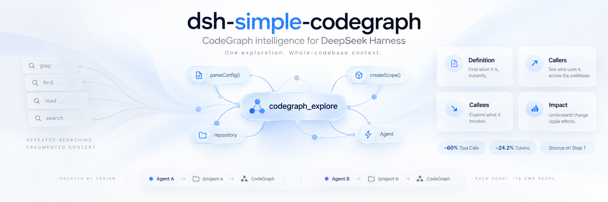

<p align="center">
  
</p>

<h1 align="center">CodeGraph for DeepSeek Harness</h1>

<p align="center">
  <a href="https://github.com/QuantumKuba/dsh-simple-codegraph/actions"></a>
  <a href="LICENSE"></a>
  <a href="https://github.com/deepseek-ai/deepseek-harness"></a>
</p>

<p align="center">
  <strong>Production-grade, per-agent <a href="https://github.com/colbymchenry/codegraph">CodeGraph</a> integration for DeepSeek Harness (DSH).</strong>
</p>

---

## Overview

**`dsh-simple-codegraph`** provides each DSH Agent with an isolated, project-scoped CodeGraph MCP connection. Instead of spending dozens of costly `grep`, `glob`, and `read_file` calls attempting to reconstruct codebase structure, agents retrieve relevant verbatim source, call hierarchies, and blast-radius impact in a single focused exploration call.

Particularly optimized for **local 20B–30B models** (e.g., Qwen 2.5/3.x 27B/32B, DeepSeek distillations) running in resource-constrained environments where tool schemas consume precious context, repeated file reads are slow, and unnecessary agent loops cause drift.

---

## Key Highlights

- 🛡️ **Genuine Per-Agent Isolation**: Every live agent receives its own scoped CodeGraph MCP stdio process pinned to its working directory.
- ⚡ **Simultaneous Multi-Project Support**: Multiple agents work in separate repositories concurrently with zero cross-project leakage.
- 🎯 **One-Tool Philosophy for Small Models**: Exposes only `codegraph_explore` by default to minimize schema token overhead and eliminate tool-selection confusion.
- 📦 **Zero-Config Bundle**: Installs natively via `dsh plugin add` with automatic upward repository root discovery (`.codegraph/`).
- 🔒 **Compaction-Safe Architecture**: Keeps `CODEGRAPH_EXPLORE_DEDUP` disabled so DSH context pruning does not invalidate subsequent model queries.
- ⏱️ **Turn-1 Handshake Guarantee**: Pre-assembles prompt tools to ensure the MCP stdio handshake completes before Turn 1 prompt dispatch.

---

## Quick Start

### 1. Prerequisites

Ensure [CodeGraph CLI](https://github.com/colbymchenry/codegraph) is installed and index your target project:

```bash
# Check installation
codegraph --version

# Index your repository (one-time setup)
cd /path/to/my-project
codegraph init
```

### 2. Install Plugin

Add the bundle to your desired DSH profile (e.g. `web`, `coding`, or default):

```bash
dsh plugin --profile web add dsh-simple-codegraph
```

### 3. Run DeepSeek Harness

Start DSH inside your indexed repository:

```bash
cd /path/to/my-project
dsh --profile web
```

The CodeGraph MCP server boots automatically for each agent session, attaches to the repository root, and exposes `mcp__codegraph__codegraph_explore` on the very first turn.

---

## Configuration Preview

Works out of the box with zero configuration. Optional settings can be added to your profile's `cordis.patch.yml`:

```yaml
- id: dsh-simple-codegraph
  config:
    command: codegraph          # CodeGraph executable or path
    toolCallTimeoutMs: 60000    # Tool execution timeout (ms)
    failOnStartupError: false   # Abort agent boot if CodeGraph fails
    routingHint: true           # Inject 1-sentence prompt routing hint
```

*For detailed options and recipes, see the [Configuration Guide](docs/configuration.md).*

---

## Documentation

Explore in-depth documentation in the [`docs/`](docs/) directory:

- 📖 **[Setup & Installation Guide](docs/setup.md)** — Detailed prerequisites, profile installations, and multi-project setup.
- ⚙️ **[Configuration Reference](docs/configuration.md)** — Complete configuration schema, custom binaries, and timeouts.
- 🏗️ **[Architecture & Design](docs/architecture.md)** — Process isolation model, lifecycle hooks, and small-model design principles.
- 🔄 **[Migration Guide](docs/migration.md)** — Upgrading from PR #1591 global MCP, `@hyzyn/dsh-codegraph`, or `jiangzhenguo/dsh-codegraph`.
- 🛠️ **[Troubleshooting Guide](docs/troubleshooting.md)** — Resolving PATH issues, unindexed projects, and collision warnings.

---

## Development & Testing

```bash
# Install dependencies
pnpm install

# Compile TypeScript
pnpm run build

# Run unit and lifecycle tests
pnpm test

# Run benchmark suite
pnpm run benchmark
```

---

## License

MIT © 2026 DeepSeek Harness Community
