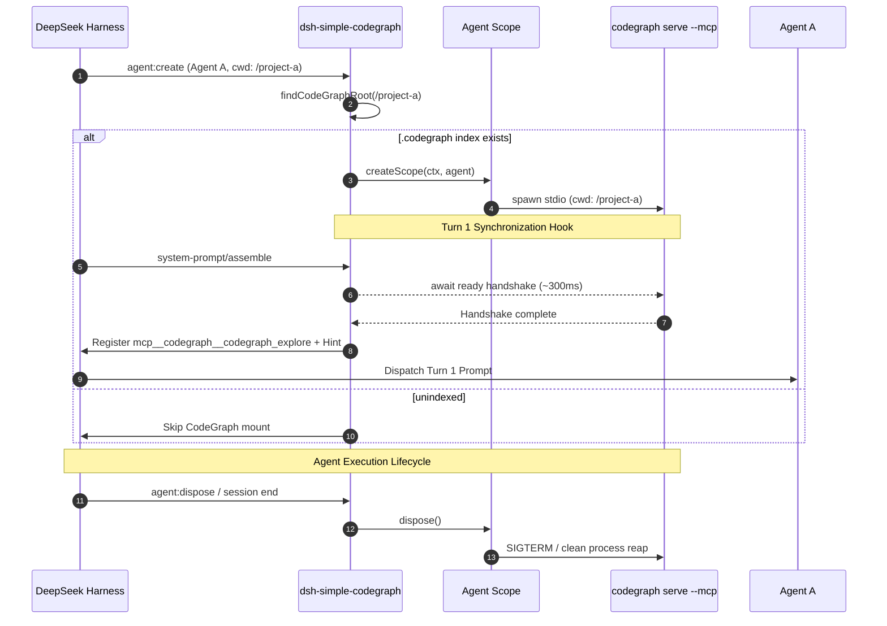

# Architecture & Design

This document details the architectural design, lifecycle guarantees, and small-model optimization strategies implemented in `dsh-simple-codegraph`.

---

## Process Isolation Architecture

Unlike alternative approaches that mount a single global MCP process and rewrite configuration files whenever the active UI tab changes, `dsh-simple-codegraph` establishes genuine agent-level encapsulation through Cordis scopes:

```
DeepSeek Harness Core
│
├── Agent A (cwd: /project-a)
│   └── Agent-Scoped Cordis Scope
│       └── @deepseek-ai/dsh-mcp-client
│           └── codegraph serve --mcp (pid: 1042, cwd: /project-a)
│
├── Agent B (cwd: /project-b)
│   └── Agent-Scoped Cordis Scope
│       └── @deepseek-ai/dsh-mcp-client
│           └── codegraph serve --mcp (pid: 1043, cwd: /project-b)
│
└── Agent C (unindexed or no cwd)
    └── CodeGraph MCP skipped cleanly (no hallucinated / wrong-codebase context)
```

### Key Architectural Benefits

1. **Per-Agent Process Boundary**: Each live agent instance receives its own isolated `codegraph serve --mcp` stdio child process pinned to that agent's session directory (`agent.session.header.cwd`).
2. **True Multi-Project Concurrency**: Multiple agents working in different repositories run side-by-side simultaneously with zero cross-talk, zero state mutation, and no shared singleton lockouts.
3. **No File Mutation**: Does not rewrite `cordis.patch.yml` or modify user configuration at runtime to track tab switching.

---

## Lifecycle Guarantees



### 1. Upward Root Discovery
When an agent is created, `dsh-simple-codegraph` examines `agent.session.header.cwd`. It traverses up the directory tree to find the nearest `.codegraph` directory. If found, the repository root is used as the working directory for CodeGraph; if not found, the mount is skipped cleanly.

### 2. Turn 1 Handshake Guarantee
MCP stdio initialization is asynchronous (~200–300ms). Without synchronization, an agent dispatching its first turn could assemble its tool schema before the MCP client finishes its handshake, causing `codegraph_explore` to be missing on Turn 1.

To eliminate this race condition, `dsh-simple-codegraph` hooks into the `system-prompt/assemble` waterfall event and awaits the active session's ready promise before allowing prompt assembly to complete.

### 3. Clean Disposal
When an agent session closes or is aborted, its child Cordis scope is disposed. This reaps the child stdio process immediately, preventing dangling or orphaned `codegraph` processes.

### 4. HMR & Plugin Teardown
If the plugin is unloaded or reloaded via Hot Module Replacement (HMR), all active agent sessions are systematically disposed.

---

## Small-Model Optimization Design

Local 20B–30B models (such as Qwen 2.5/3.x 27B/32B or local DeepSeek distillations) operate with limited context windows and reduced schema-distinction capacity compared to massive 70B+ or proprietary cloud models. `dsh-simple-codegraph` implements three specific architectural optimizations for these models:

### 1. The One-Tool Philosophy

When an agent is presented with 8–13 fragmented tools (`node`, `callers`, `callees`, `impact`, `files`, `status`, etc.):
- Unused tool schemas bloat context by 1,000+ tokens per turn.
- Models experience tool-selection confusion (e.g. calling `files` when they need AST paths).
- Small models frequently give up on specialized tools and fall back to brute-force `grep` or sequential `read_file` loops.

`dsh-simple-codegraph` preserves CodeGraph's upstream design: it exposes **only** `codegraph_explore` (namespaced as `mcp__codegraph__codegraph_explore`). A single query retrieves verbatim line-numbered source, AST relationships, and blast-radius callers/callees.

### 2. Context Compaction & Cross-Call Dedup

CodeGraph provides an upstream deduplication flag (`CODEGRAPH_EXPLORE_DEDUP`). However, in DeepSeek Harness, compaction plugins (`dsh-compaction-tool-result-pruner` and `dsh-compaction-basic`) prune or summarize earlier tool results as conversation history expands.

If cross-call dedup were enabled, CodeGraph would return:
```
"Symbol 'UserService' was already returned earlier in this session."
```
Since the earlier result was pruned by DSH context compaction, the agent would lose access to the source code entirely. Therefore, **`CODEGRAPH_EXPLORE_DEDUP` is intentionally kept disabled**. Correctness is strictly prioritized over marginal token savings.

### 3. Microscopic Routing Hint

Rather than injecting thousands of tokens of duplicate documentation or static rules into every turn, `dsh-simple-codegraph` injects a single concise sentence only when operating in an indexed repository:

> *"CodeGraph is active for this repository. For code discovery, architecture, call flows, symbol locations, and blast-radius exploration, prefer `mcp__codegraph__codegraph_explore` over raw grep or file reads. Verbatim line-numbered source returned by CodeGraph is already read."*

This produces immediate behavioral compliance without degrading attention or consuming context budget.
